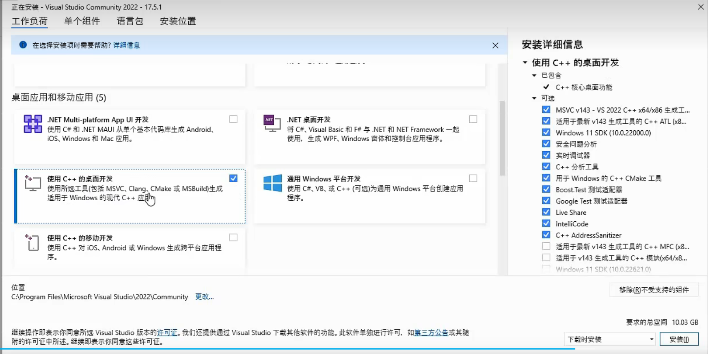
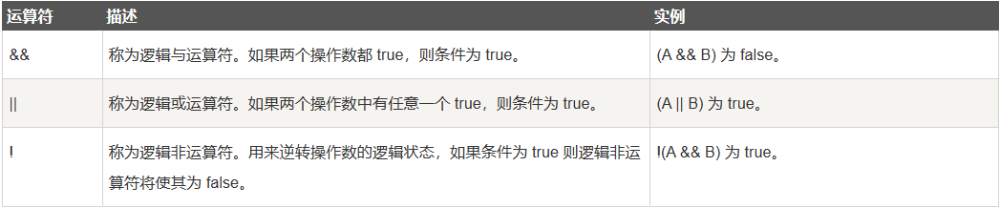
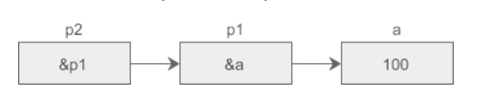
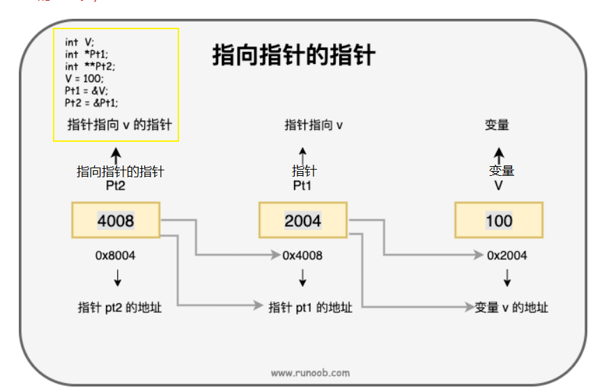
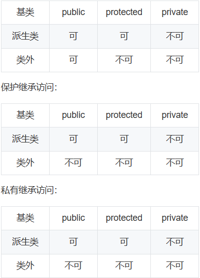

# C++的应用领域

1. 桌面应用
   - 主要基于windows平台的应用
2. 系统级软件
   - 操作系统
   - 驱动程序
   - 数据库
   - 网络协议
3. 底层架构
   - java虚拟机
   - python解释器
   - ai核心库
4. 游戏开发
   - 游戏引擎
   - 服务器端
   - 客户端
5. 嵌入式开发
   - 工业控制
   - 智能家电
   - 航天航空
   - 电子通信

# 第一部分 基础部分

## visual studio安装

1. 进入官网下载：[下载地址](https://visualstudio.microsoft.com/zh-hans/downloads/)

2. 选择community版下载

   

3. 下载完启动

   

4. 选择C++即可




## 简单上手—Hello world!

1. 创建一个C++空项目

   

2. 配置名称，位置，解决方案（合并）

   

3. 解决方案资源管理器中在源文件中新建项目

   

   

4. 打印Hello world！

   ~~~c++
   // 预处理器指令,包含 iostream 头文件,提供 I/O 流功能。
   #include<iostream>
   //命名空间指示,表示会使用 std 命名空间,其中包含 I/O 流库。
   using namespace std;
   //等价于：
   /*
   int main(){
   	std::cout<<"hello world"<<std::endl;
   }
   */
   //主函数,C++ 程序的入口点。唯一
   int main()
   {
   	//使用 cout 输出流打印 "hello world!" ,并换行(endl)。
   	cout << "hello world!" << endl;
   }
   /*
   1. 包含 I/O 流头文件
   2. 指定使用 std 命名空间
   3. 定义 main 函数作为程序入口
   4. 使用 cout 在主函数中打印 "hello world!" 并换行
   5. 结束主函数 
   这是一个标准的最小 C++ 程序,演示了 C++ 程序的基本结构,以及 cout 流的使用。
   */
   ~~~

5. 进行编译运行
   

6. 打印结果显示

   

## 函数的基本使用

自定义函数

~~~c++
#include<iostream>

using namespace std;

//自定义函数
//格式 返回类型 函数名（接收的参数）{函数体}
void hellowfun()
{
	cout << "hello world!" << endl;

}

int main()
{
	hellowfun();
	system("pause");
}
~~~

##  包模块体验

1. 新建项，名称为：func_hellow.cpp文件

   

2. 在func_hellow.cpp文件编写代码：

   ~~~c++
   #include<iostream>
   
   using namespace std;
   
   void func_hellow()
   {
   	cout << "hello world!" << endl;
   }
   ~~~

3. 在hell_world.cpp中进行编写代码

   ~~~c++
   #include<iostream>
   
   using namespace std;
   
   //声明函数
   void func_hellow();
   
   int main()
   {
   	//调用函数
   	func_hellow();
   
   	system("pause");
   }
   ~~~

4. 运行看结果

   

5. 总结
   1. 在func_hellow.cpp文件中，把我们要实现的功能代码完整的写在里面。
   2. 在hell_world.cpp文件中，我们可以调用我们func_hellow.cpp中的函数，先声明，后调用。
   3. 优点
      - 可重用性:将一组相关功能放在一个模块中,可以很方便地在其他地方重用这个模块。
      - 低耦合:每个模块都有自己明确的功能和接口,与其他模块松散耦合,相互依赖较小。这使得修改某个模块时,对其他模块的影响较小。
      - 高内聚:每个模块都聚焦于一组相关的功能,使得模块内部各个部分之间高度相关,易于理解和维护。
      - 分层设计:可以根据功能将模块划分为不同的层,从而得到一个分层的系统结构。

## 变量

1. 变量的定义与初始化

   - 定义:指定变量的类型和名称。

   - 初始化:定义变量的同时给它一个初始值。

     ~~~c++
     int x;      // 定义整型变量x
     int y = 0;  // 定义整型变量y并初始化为0
     //变量只有初始化后才可以使用
     
     /*
     1．变量名只能是字母（A-Z,a-z）、数字(0-9)或下划线。
     2．第一个字母不能是数字。
     3．不能是c++关键字，要见名知义比如sum是求和
     */
     ~~~

2. 变量的作用域

   - 变量的作用域决定了从何处可以使用该变量。C++ 有块级作用域、函数作用域和文件作用域。

     ~~~c++
     {  // 块级作用域
         int x = 0; 
     }
     // x 的作用域仅在上面的块中
     
     void foo() {  // 函数作用域
         int y = 0;
     }
     // y 的作用域仅在foo函数中
     
     int z = 0; // 文件作用域 
     // z 的作用域为该源文件的全部
     ~~~

3. 变量的声明周期
   - 变量的生命周期是指变量存在的时间。它取决于变量的存储持续时间以及作用域。
   - 例如,局部变量的生命周期为其作用域所在的代码块执行期间。全局变量的生命周期为程序的整个运行期间。

### 变量的类型

C++ 支持多种变量类型,主要分为:- 基本类型:整型、浮点型、布尔型、字符型等
- 派生类型:指针、数组、结构体、联合体、枚举等
- 复合类型:类、命名空间等


~~~c++
      char ：1个字节

      char*(即指针变量): 8个字节

      short int : 2个字节

      int：  4个字节

      unsigned int : 4个字节

      float:  4个字节

      double:   8个字节

      long:   4 / 8个字节(视具体情况而定)

      long long:  8个字节

      unsigned long:  8个字节
	  bool a=true;//true-真，实值为非0  1个字节
	  bool b=flase;//flase-假，实值为0
~~~

5. 变量的操作

   1. 赋值操作使用 = 运算符将右侧的值赋给左侧的变量。例如:

   ```
   cpp
   int a = 0;   // 初始化赋值
   a = 10;       // 赋值
   ```

   2. 复合赋值操作使用 +=、-=、*=、/=、%= 等运算符执行赋值计算。例如:

   ```
   cpp 
   a += 5;   // 等价于 a = a + 5;
   b -= 2;   // 等价于 b = b - 2;
   c *= 3;   // 等价于 c = c * 3;
   ```

   3. 类型转换使用类型转换运算符将一种数据类型转换为另一种数据类型。例如:

   ```
   cpp
   int a = 1;
   double b = a;          // 自动类型转换,int -> double  
   char c = 'a';
   int d = (int)c;        // 显示类型转换,char -> int
   ```

   4. 增/减使用 ++/-- 运算符对变量进行增减操作。例如:

   ```
   cpp 
   a++;  // 后增,等价于 a = a + 1
   ++a;  // 前增,等价于 a = a + 1 
   b--;  // 后减,等价于 b = b - 1
   --b;  // 前减,等价于 b = b - 1
   ```

   5. 一元/二元运算使用 +、-、*、/ 等一元和二元运算符执行算术运算。例如:

   ```
   cpp
   a = +1;   // 一元 +,无变化 
   b = -2;   // 一元 -,变为相反数
   c = a * b; // 二元 *,相乘 
   d = a / b; // 二元 /,相除
   ```

   6. 逻辑运算使用 &&、|| 和 ! 执行逻辑运算。例如:

   ```
   cpp
   bool c = true;
   bool d = false;
   c && d;  // 逻辑与,值为 false
   c || d;  // 逻辑或,值为 true  
   !c;      // 逻辑非,值为 false
   ```

## 运算符

运算符是一种告诉编译器执行特定的数学或逻辑操作的符号。C++ 内置了丰富的运算符，并提供了以下类型的运算符：

- 算术运算符
- 关系运算符
- 逻辑运算符
- 位运算符
- 赋值运算符
- 杂项运算符

### 算术运算符


例子：

~~~c++
 	#include<iostream>

using namespace std;

int main()
{
	int a = 21;
	int b = 10;
	int c;

	c = a + b;
	cout << "Line 1 - c 的值是 " << c << endl;
	c = a - b;
	cout << "Line 2 - c 的值是 " << c << endl;
	c = a * b;
	cout << "Line 3 - c 的值是 " << c << endl;
	c = a / b;
	cout << "Line 4 - c 的值是 " << c << endl;
	c = a % b;
	cout << "Line 5 - c 的值是 " << c << endl;

	int d = 10;   //  测试自增、自减
	c = d++;
	cout << "Line 6 - c 的值是 " << c << endl;

	d = 10;    // 重新赋值
	c = d--;
	cout << "Line 7 - c 的值是 " << c << endl;

	system("pause");
}
~~~

### 关系运算符


例子：

~~~c++
#include<iostream>

using namespace std;

int main()
{
	int a = 21;
	int b = 10;
	int c;
    
	if (a == b)
	{
		cout << "Line 1 - a 等于 b" << endl;
	}
	else
	{
		cout << "Line 1 - a 不等于 b" << endl;
	}
	if (a < b)
	{
		cout << "Line 2 - a 小于 b" << endl;
	}
	else
	{
		cout << "Line 2 - a 不小于 b" << endl;
	}
	if (a > b)
	{
		cout << "Line 3 - a 大于 b" << endl;
	}
	else
	{
		cout << "Line 3 - a 不大于 b" << endl;
	}
	/* 改变 a 和 b 的值 */
	a = 5;
	b = 20;
	if (a <= b)
	{
		cout << "Line 4 - a 小于或等于 b" << endl;
	}
	if (b >= a)
	{
		cout << "Line 5 - b 大于或等于 a" << endl;
	}

	system("pause");
}
~~~

### 逻辑运算符



例子：

~~~c++
#include<iostream>

using namespace std;

int main()
{
	int a = 5;
	int b = 20;
	int c;

	if (a && b)
	{
		cout << "Line 1 - 条件为真" << endl;
	}
	if (a || b)
	{
		cout << "Line 2 - 条件为真" << endl;
	}
	/* 改变 a 和 b 的值 */
	a = 0;
	b = 10;
	if (a && b)
	{
		cout << "Line 3 - 条件为真" << endl;
	}
	else
	{
		cout << "Line 4 - 条件不为真" << endl;
	}
	if (!(a && b))
	{
		cout << "Line 5 - 条件为真" << endl;
	}

	system("pause");
}
~~~

### 位运算符


### 赋值运算符


例子：

~~~c++
#include<iostream>

using namespace std;

int main()
{
    
int a = 21;
int c;

c = a;
cout << "Line 1 - =  运算符实例，c 的值 = : " << c << endl;

c += a;
cout << "Line 2 - += 运算符实例，c 的值 = : " << c << endl;

c -= a;
cout << "Line 3 - -= 运算符实例，c 的值 = : " << c << endl;

c *= a;
cout << "Line 4 - *= 运算符实例，c 的值 = : " << c << endl;

c /= a;
cout << "Line 5 - /= 运算符实例，c 的值 = : " << c << endl;

c = 200;
c %= a;
cout << "Line 6 - %= 运算符实例，c 的值 = : " << c << endl;

c <<= 2;
cout << "Line 7 - <<= 运算符实例，c 的值 = : " << c << endl;

c >>= 2;
cout << "Line 8 - >>= 运算符实例，c 的值 = : " << c << endl;

c &= 2;
cout << "Line 9 - &= 运算符实例，c 的值 = : " << c << endl;

c ^= 2;
cout << "Line 10 - ^= 运算符实例，c 的值 = : " << c << endl;

c |= 2;
cout << "Line 11 - |= 运算符实例，c 的值 = : " << c << endl;


	system("pause");
}
~~~

### 杂项运算符


### C++运算符优先级（由高到低）


## 循环

有的时候，可能需要多次执行同一块代码。一般情况下，语句是顺序执行的：函数中的第一个语句先执行，接着是第二个语句，依此类推。

编程语言提供了允许更为复杂的执行路径的多种控制结构。

循环语句允许我们多次执行一个语句或语句组。

### while循环

当给定条件为真时，重复语句或语句组。它会在执行循环主体之前测试条件。

1. 语法

   ~~~c++
   while(条件表达式)
   {
      循环体;
   }
   //当条件表达式为真时，执行循环体，执行后再次到条件表达式
   ~~~

2. 流程图

   *while* 循环的关键点是循环可能一次都不会执行。当条件被测试且结果为假时，会跳过循环主体，直接执行紧接着 while 循环的下一条语句。

   3. 例子：

   ~~~c++
   #include<iostream>
   
   using namespace std;
   
   int main()
   {
   	//定义变量 a 赋值为10
   	int a = 10;
   
   	//条件表达式，当a<20时 执行while循环体语句
   	while (a<20)
   	{
   		//打印 a 值
   		cout << a << endl;
   		// a自增
   		a++;
   	}
   
   	system("pause");
   }
   ~~~


### for循环

**for** 循环允许我们呢编写一个执行特定次数的循环的重复控制结构。

1. 语法

   ~~~c++
   for ( init; condition; increment )
   {
      statement(s);
   }
   /*
   init 会首先被执行，且只会执行一次。声明并初始化任何循环控制变量。也可以不在这里写任何语句，只要有一个分号出现即可。
   
   接下来，会判断 condition。如果为真，则执行循环主体。如果为假，则不执行循环主体，且控制流会跳转到紧接着 for 循环的下一条语句。
   
   在执行完 for 循环主体后，控制流会跳回上面的 increment 语句。该语句允许您更新循环控制变量。该语句可以留空，只要在条件后有一个分号出现即可。
   
   条件再次被判断。如果为真，则执行循环，这个过程会不断重复（循环主体，然后增加步值，再然后重新判断条件）。在条件变为假时，for 循环终止。
   */
   ~~~

   2. 流程图

   

3. 例子

   ~~~c++
   #include <iostream>
   using namespace std;
    
   int main ()
   {
      // for 循环执行
      for( int a = 10; a < 20; a = a + 1 )
      {
          cout << "a 的值：" << a << endl;
      }
       system("pause");
   }
   ~~~

   ### 基于范围的for循环（c++11）

   for语句允许简单的范围迭代，用于遍历容器中的元素。

   1. 语法

      ~~~c++
      for (元素类型 变量 : 容器) {
          // 循环体
      }
      ~~~

   2. 遍历数组

   ~~~c++
   #include <iostream>
   using namespace std;
   
   int main()
   {
       int a[4] = { 1, 2, 3, 4 };
       for (int &x : a)
       {
           cout << x << endl;
       }
       system("pause");
   }
   
   ~~~

   如果修改x的值也会修改数组的值

   ~~~c++
   #include <iostream>
   using namespace std;
   
   int main()
   {
       int a[4] = { 1, 2, 3, 4 };
       for (int &x : a)//用&x等于取地址；用x只是拷贝值 x,修改x对不影响原数组
       {
           cout << x << endl;
           x=10;
       }
       for (int& x : a)
       {
           cout << x << endl;
       }
       system("pause");
   }
   ~~~

   打印结果：

   

3. range for 语句

   ~~~c++
   #include<iostream>  
   #include<string>  
   #include<cctype>  
   using namespace std;  
     
   int main()  
   {  
       string str("some string");  
       // range for 语句  
       for(auto &c : str) 
     //auto 的工作原理是类型推导。在编译时,编译器会自动推导出auto右侧的表达式类型,将auto转换为该类型。
       {  
           c = toupper(c);  
       }  
       cout << str << endl;  
       system("pause");
   }
   //上面的程序使用Range for语句遍历一个字符串，并将所有字符全部变为大写，然后输出结果为：
   ~~~

### do...while循环

**do...while** 循环与 while 循环类似，但是 do...while 循环会确保至少执行一次循环。

1. 语法

   ~~~c++
   do
   {
      statement(s);
   
   }while( condition );
   
   /*
   条件表达式出现在循环的尾部，所以循环中的 statement(s) 会在条件被测试之前至少执行一次
   如果条件为真，控制流会跳转回上面的 do，然后重新执行循环中的 statement(s)。
   这个过程会不断重复，直到给定条件变为假为止。
   */
   ~~~

2. 流程图

   

3. 例子

   ~~~c++
   #include <iostream>
   using namespace std;
    
   int main ()
   {
      // 局部变量声明
      int a = 10;
   
      // do 循环执行
      do
      {
          cout << "a 的值：" << a << endl;
          a = a + 1;
      }while( a < 20 );
    
      system("pause");
   }
   ~~~

   

## 判断

### if语句

1. 语法

   ~~~c++
   if (boolean_expression)
   {
       //布尔为true时执行的语句
   }
   ~~~

   

### if...else语句

1. 语法

   ~~~c++
   if(boolean_expression)
   {
      // 如果布尔表达式为真将执行的语句
   }
   else
   {
      // 如果布尔表达式为假将执行的语句
   }
   //如果布尔表达式为 true，则执行 if 块内的代码。如果布尔表达式为 false，则执行 else 块内的代码。
   ~~~

### if嵌套语句

1. 语法

   ~~~c++
   if (condition1) {
      // 如果 condition1 为 true，则执行此处的代码块
      if (condition2) {
         // 如果 condition2 也为 true，则执行此处的代码块
      }
      else {
         // 如果 condition2 为 false，则执行此处的代码块
      }
   }
   else {
      // 如果 condition1 为 false，则执行此处的代码块
   }
   ~~~

2. 例子：

   ~~~c++
   #include <iostream>
   using namespace std;
    
   int main ()
   {
      // 局部变量声明
      int a = 100;
      int b = 200;
    
      // 检查布尔条件
      if( a == 100 )
      {
          // 如果条件为真，则检查下面的条件
          if( b == 200 )
          {
             // 如果条件为真，则输出下面的语句
             cout << "a 的值是 100，且 b 的值是 200" << endl;
          }
      }
      cout << "a 的准确值是 " << a << endl;
      cout << "b 的准确值是 " << b << endl;
    
      system("pause");
   }
   ~~~

## 数组（复合数据类型）

**数组**：存储一个固定大小的相同类型元素的顺序集合，由连续的内存位置组成。最低的地址对应第一个元素，最高的地址对应最后一个元素。

### 一维数组

1. 一维数组的声明形式

   ~~~c++
   type arrayName [ arraySize ];
   //声明一维数组
   //arraySize 必须是一个大于零的整数常量，type 可以是任意有效的 C++ 数据类型。
   
   //例如：
   double balance[10];
   ~~~

2. 初始化数组

   ~~~c++
   double balance[5] = {1000.0, 2.0, 3.4, 7.0, 50.0};
   //大括号 { } 之间的值的数目不能大于我们在数组声明时在方括号 [ ] 中指定的元素数目。
   
   //如果您省略掉了数组的大小，数组的大小则为初始化时元素的个数。因此，如果：
   double balance[] = {1000.0, 2.0, 3.4, 7.0, 50.0};
   
   //访问数组最后一个元素
   i = balance[4] 
   ~~~

3. 例子

   ~~~c++
   #include <iostream>
   using namespace std;
    
   int main ()
   {
      int n[ 10 ]; // n 是一个包含 10 个整数的数组
    
      // 初始化数组元素          
      for ( int i = 0; i < 10; i++ )
      {
         n[ i ] = i + 100; // 设置元素 i 为 i + 100
      }
    
      // 输出数组中每个元素的值                     
      for ( int j = 0; j < 10; j++ )
      {
         cout << "a["<< j << "]" << n[ j ] << endl;
      }
    
      system("pause");
   }
   ~~~

   

### 多维数组

1. 多维数组的声明形式

   ~~~c++
   type name[size1][size2]...[sizeN];
   
   //例如，下面的声明创建了一个三维 5 . 10 . 4 整型数组：
   
   int threedim[5][10][4];
   ~~~

   

2. 初始化二维数组

   ~~~c++
   int a[3][4] = {  
    {0, 1, 2, 3} ,   /*  初始化索引号为 0 的行 */
    {4, 5, 6, 7} ,   /*  初始化索引号为 1 的行 */
    {8, 9, 10, 11}   /*  初始化索引号为 2 的行 */
   };
   // 也可以只用一对大括号，方便阅览内嵌套大括号更好
   
   // 只用一对大括号与上面等同
   int a[3][4] = {
       1,2,3,4,5,6,7,8,9,0
   }
   ~~~

   

3. 例子

   ~~~c++
   #include <iostream>
   using namespace std;
   
   int main()
   {
           // 一个带有 5 行 2 列的数组
           int a[5][2] = { {0,0}, {1,2}, {2,4}, {3,6},{4,8} };
   
           // 输出数组中每个元素的值                      
           for (int i = 0; i < 5; i++)
               for (int j = 0; j < 2; j++)
               {
                   cout << "a[" << i << "][" << j << "]: ";
                   cout << a[i][j] << endl;
               }
   
   
       system("pause");
   }
   ~~~

# 字符串string

~~~c++
#include<iostream>
#include<string>
using namespace std;

int main() {
	
	//初始化
	//默认初始化
	string s1;
	//拷贝初始化
	string s2 = s1;
	string s3 = "Hellow world";

	//直接初始化
	string s4("hellow world!");
	string s5(4,'h');
	cout << s5 << endl;

	//访问字符
	cout <<"s4[3] : " << s4[3] << endl; 

	s4[0] = 'H';
	cout << "s4 : " << s4 << endl;

	//遍历
	for(int i=0;i<s4.size();i++)
	s4[i] = toupper(s4[i]);
	cout << "s4 : " << s4 << endl;


	//拼接
	string str1 = "hellow", str2("world!");
	cout << "str1: " << str1 << endl;

	string str3 = str1 + str2;
	cout << str3 << endl;

	// str5 = "hellow" + "worlds!"; 错误拼接不能全用常量拼接

	//字符串比较
	str1 = "hellow";
	str2 = "hellow world";
	str3 = "hehehhehe";
	cout << (str1 == str2 ? "true" : "false") << endl;
	cout << (str1 < str2 ? "true" : "false") << endl;
	cout << (str1 >= str3 ? "true" : "false") << endl;

	system("pause");
}
~~~

# 读取键盘输入

~~~c++
#include<iostream>
#include<string>
using namespace std;

int main() 
{
	//读取键盘输入
	// 
	//遇到空白符（空格）停止,读取单词
	string str1,str2;
/*
	cin >> str1;
	cout << str1 << endl;

	cin >> str2;
	cout << str2 << endl;//输入hellow world 看结果

*/

	//cin >> str1 >> str2;
	//cout << str1 << str2 << endl;
	//string str;


	//getline()读取一行
	//string str3;
	//getline(cin, str3);
	//cout << str3 << endl;

	//cin.get读取一个字符
	char ch;
	ch = cin.get();
	cout << ch << endl;

	system("pause");
}
~~~

# 简单读写文件

c++的io库中提供了专门用于文件输入的ifstream类和用于文件输出的ofstream类，需要引入头文件fstream。

~~~c++
#include<iostream>
#include<fstream>
#include<string>

using namespace std;

int main() {
	//input 流式读对象
	ifstream input("io_input.txt");
	ofstream output("io_output.txt");

	//1.按单词逐个读取
	//string word;
	//while (input >> word)
	//{
	//	cout << word << endl;
	//}

	//2.按字符读取
	//char a;
	//while (input >> a)
	//	cout << a << endl;

	//3.按行读取
	//string str;
	//while (getline(input, str))
	//	cout << str << endl;

	//4.写入到文件中
	char b;
	while ( input >> b )
	{
		output << b<< endl;
	}


	system("pause");
}
~~~

# 结构体

结构体：自定义数据类型,用于存储不同类型的数据。

## 1.结构体声明初始化

语法：

~~~C++
struct 结构体名 {
    类型1 成员1;
    类型2 成员2;
    ...
};
~~~

例子：

~~~c++
#include<iostream>
#include<string>

using namespace std;

//定义学生信息结构体
struct StudentInfo
{
	string name;
	int age;
	double score;
}stu2, stu3 = {"ls",16,75.7};  //可以在定义结构后立即创建对象

int main() {
	//创建数据对象并初始化  
	StudentInfo stu1 = {"zs",16,78.3};

	//使用结构体初始化结构体
	StudentInfo stu4 = stu3;
	system("pause");
}
~~~

## 2.访问结构体数据

~~~c++
#include<iostream>
#include<string>

using namespace std;

//定义学生信息结构体
struct StudentInfo
{
	string name;
	int age;
	double score;
}stu2, stu3 = {"ls",16,75.7};  //可以在定义结构后立即创建对象

int main() {
	//创建数据对象并初始化  
	StudentInfo stu1 = {"zs",16,78.3};

	//使用结构体初始化结构体S
	StudentInfo stu4 = stu3;

	//打印结构体，通过.运算符访问结构体成员 ，还可以修改其值
	cout << stu1.name <<  stu1.age << stu1.score << endl;

	system("pause");
}
~~~

## 3.结构体数组

~~~c++
#include<iostream>
#include<string>

using namespace std;

//定义学生信息结构体
struct StudentInfo[2]
{{string name;
	int age;
	double score;
 },
 {string name;
	int age;
	double score;
 }
	
}stu2, stu3 = {"ls",16,75.7};  //可以在定义结构后立即创建对象

int main() {
	//创建数据对象并初始化  
	StudentInfo stu1 = {{"ls",16,75.7},{"zs",16,78.3}};

	//使用结构体初始化结构体S
	StudentInfo stu4 = stu3;

	//打印结构体，通过.运算符访问结构体成员 ，还可以修改其值
	cout << stu1[1].name <<  stu1[1].age << stu1[1].score << endl;

	system("pause");
}
~~~

# enum枚举

1. 语法格式

   ~~~c++
   enum 名称
   {
      枚举器1[,枚举器2...] 
   } 变量[,变量...]; //可以在后面定义 
   
   /*
   
   名称 - 枚举的名称 
   枚举器 - 枚举的成员 
   变量 - 枚举类型的变量
   
   */
   ~~~

- 枚举类型的值默认从0开始递增
- 枚举类型只允许存储整数类型的值。
- 枚举器通常被用作常量。

2. 例子

   ~~~c++
   #include<iostream>
   #include<string>
   
   using namespace std;
   
   //定义枚举类型
   enum week
   {
   	Mon=30,Tue,Web,Thu,Fri,Sat,Sun 
      //枚举器 默认情况下,第一个枚举器的值为0,依次递增1，如果中间有值改变，后面的依次递增1
   };
   
   int main() {
   
   	week w1 = Mon;
   	cout << w1 << endl;
   	cout<<
   
   	system("pause");
   }
   ~~~


# 指针

指针用于存储另一变量的地址,可以通过该地址间接访问变量。指针可用于:

1. 传递、返回函数的参数和结果。

2. 链式、队列、树等数据结构。
3. 动态内存分配。

## 指针的定义

1. 语法

   ~~~c++
   //类型 *指针变量；
   //类型* 指针变量；
   int *p;
   int* p;
   ~~~

2. 例子

   ~~~c++
   #include<iostream>
   
   using namespace std;
   
   int main()
   {
   	//定义指针
   	int* p;
   	long* q;
   	long long* x;
   	cout << sizeof(p) << endl;
   	cout << sizeof(q) << endl;
   	cout << sizeof(x) << endl;
   
   
   	system("pause");
   }
   ~~~

   

## 指针的用法

~~~c++
#include<iostream>

using namespace std;

int main()
{
	//定义指针
	int* p;
	int* q;
	long long* x;
	cout << sizeof(p) << endl;
	cout << sizeof(q) << endl;
	cout << sizeof(x) << endl;

	//指针的使用
	// 有*为内容，无*为地址
	int a = 10;
	int b = 20;
	p = &a;
	q = &b;
	cout << &a << endl;
	cout << &b << endl;
	cout << p << endl;
	cout << q << endl;

	//修改p的值
	*p = 15;
	cout << a << endl;
	//修改p的值也会修改a的值，因为p存储的就是a的地址
	system("pause");
}
~~~


## 野指针，空指针，void*指针

1. 野指针

   ~~~c++
   int *p ;
   *p = 20;
   //没有初始化，不确定值和位置，如果是系统核心区域，修改数据会导致系统崩溃，这就是野指针
   ~~~

   

2. 空指针

   ~~~c++
   int* p=nullptr; //空指针字面值
   p=NULL; // 预处理变量
   p = 0; //0值
   //先定义指针，不知道要指向哪个对象，此时，给它初始化为空指针，不指向任何对象。
   ~~~

   

3. void*指针

   void*指针 可以存放任意对象的地址，不需要类型和指向的对象类型匹配。

~~~c++
int i=100;
char a='a';
string s="hellow";

void* q = &i;
q = &a;
q = &s;
*p; //void*指针 只可以存放地址和比较大小 而不可以使用内容；
~~~

## 指向指针的指针

- 指向指针的指针是一种多级间接寻址的形式，或者说是一个指针链。
- 指针的指针就是将指针的地址存放在另一个指针里面。
- 通常，一个指针包含一个变量的地址。当我们定义一个指向指针的指针时，第一个指针包含了第二个指针的地址，第二个指针指向包含实际值的位置。

假设有一个 int 类型的变量 a，p1是指向 a 的指针变量，p2 又是指向 p1 的指针变量，它们的关系如下图所示:





1. 例子：

~~~c++
#include<iostream>

using namespace std;

int main()
{
	//定义指针
	int* p;
    
	int a = 10;
    // 有*为内容，无*为地址
	p = &a;


	//指向指针的指针
	int** pr;
	pr = &p;
	cout << &pr << endl; // pr自己在内存中的地址
	cout << pr << endl; // 指向的p的地址
	cout << &p << endl; // p自己的地址
	cout << *pr << endl; //指向p指向的地址 即，p指向a的地址，pr也是指向的a的地址
	cout << p << endl;

	cout << &a << endl;
	cout << **pr << endl;

	system("pause");
}
~~~


# 引用

C++中的引用可以理解为给一个变量取了另一个名字,二者实际指向同一个对象。

1. 定义引用

   ~~~c++
   int a = 5;
   int &b = a;  // b是a的引用,两个变量实际指向同一个对象
   //如同给a取了一个别名
   ~~~

2. 对引用的操作

   ~~~c++
   b = 10;  //实际上修改的是a的值
   
   //定义一个新变量c
   c = 25;
   b=c;
   //此时，b=c的操作是将c的值赋值给b，而b引用的是a，最后a的值为25
   
   /*
   总结：
   	一旦引用被初始化为一个对象，就不能被指向到另一个对象。指针可以在任何时候指向到另一个对象。
   	
   	引用必须在创建时被初始化。指针可以在任何时间被初始化不存在空引用。
   */
   ~~~

   

3. 引用的引用

   C++ 中引用的引用还是实质上对变量进行了另一层引用,只不过是这样做的方式是通过引用本身。

   ~~~c++
   int a = 5; 
   int &b = a;   // b是a的引用,b相当于a的一个别名
   int &&c = b;  // c是b的引用,c相当于b的又一个别名
                // 也就是说c实际上是a的一个二次别名
   ~~~

   ~~~c++
   c = 10;  // 实际修改的是a的值,因为c最终引用的是a
   ~~~

   总结：

   - 引用的引用仍然是对变量的引用,只不过是通过中介引用(b)进行的
   - 因此最终操作还是变量a
   - 引用的引用相当于给别名取了一个别名

4. 案例

   ~~~c++
   #include<iostream>
   
   using namespace std;
   
   int main()
   {
   	//引用
   	int a = 10, b = 30;
   	// 绑定一样 ref就是a,如何操作ref就是操作a，
   	int& ref = a; 
   	cout << ref << endl;
   	cout << &ref << endl;
   	cout << &a << endl;
   	ref = b; //等价 a = b;
   	cout << ref << endl;
   	cout << a << endl;
   
   	//引用的引用
   	int& rref = ref;
   	rref = 36;
   	cout << ref << endl;
   	cout << rref << endl;
   	cout << a << endl;
   
   
   	system("pause");
   }
   ~~~

# 面向对象

## 类与对象

类用于指定对象的形式，它包含了数据表示法和用于处理数据的方法。类中的数据和方法称为类的成员。函数在一个类中被称为类的成员。

1. 类定义

   ~~~c++
   class Box
   {
      public:
         double length;   // 盒子的长度
         double breadth;  // 盒子的宽度
         double height;   // 盒子的高度
   };
   ~~~

   关键字 **public** 确定了类成员的访问属性。在类对象作用域内，公共成员在类的外部是可访问的。您也可以指定类的成员为 **private** 或 **protected**，这个我们稍后会进行讲解。

2. 定义对象

   ~~~c++
   Box Box1;          // 声明 Box1，类型为 Box
   Box Box2;          // 声明 Box2，类型为 Box
   ~~~

   

3. 访问类成员

   ~~~c++
   #include <iostream>
   
   using namespace std;
   
   class Box
   {
      public:
         double length;   // 长度
         double breadth;  // 宽度
         double height;   // 高度
   };
   
   int main( )
   {
      Box Box1;        // 声明 Box1，类型为 Box
      Box Box2;        // 声明 Box2，类型为 Box
      double volume = 0.0;     // 用于存储体积
   
      // box 1 详述
       //类的对象的公共数据成员可以使用直接成员访问运算符 (.) 来访问。
      Box1.height = 5.0; 
      Box1.length = 6.0; 
      Box1.breadth = 7.0;
   
      // box 2 详述
      Box2.height = 10.0;
      Box2.length = 12.0;
      Box2.breadth = 13.0;
   
      // box 1 的体积
      volume = Box1.height * Box1.length * Box1.breadth;
      cout << "Box1 的体积：" << volume <<endl;
   
      // box 2 的体积
      volume = Box2.height * Box2.length * Box2.breadth;
      cout << "Box2 的体积：" << volume <<endl;
      
       system("pause");
   }
   ~~~

   

## 类的成员函数

成员函数：类函数，类方法，定义在类内部的函数。

​		   成员函数只是属于该类的，只能访问这个类的成员变量和其他内容。

1. 使用成员函数访问类的成员

   ~~~c++
   class Box
   {
      public:
         double length;         // 长度
         double breadth;        // 宽度
         double height;         // 高度
         double getVolume(void);// 返回体积
   };
   ~~~


2. 成员函数可以定义在类的内部

   ~~~c++
   class Box
   {
      public:
         double length;         // 长度
         double breadth;        // 宽度
         double height;         // 高度
         double getVolume(void)
         {
             return lenght * breadth * height;
         }
   };
   ~~~

   

3. 在类的外部使用定义函数（在类的内部声明成员函数），使用::范围解析运算符定义

   ~~~c++
   class Box
   {
      public:
         double length;         // 长度
         double breadth;        // 宽度
         double height;         // 高度
         double getVolume(void);// 声明
   };
   
   double Box::getVolume(void):
   {
       return lenght * breadth * height; 
   }
   
   // :: 等于给函数打一个标签，表示是哪个对象中的函数
   ~~~

4. 调用成员函数

   ~~~c++
   //创建对象
   Box Box1;
   
   Box1.lenght = 12.3;
   Box1.breadth = 23.1;
   Box1.height = 14.3;
   
   //调用成员函数，使用 .运算符
   Box1.getVolume()
   ~~~

   

5. 案例

   ~~~c++
   #include<iostream>
   
   using namespace std;
   
   
   class Box
   {
   public:
       double length;   // 长度
       double breadth;  // 宽度
       double height;   // 高度
   
       // 成员函数声明
       double getVolume(void);
   
       void setLen(double len);
   
       void setBre(double bre);
   
       void setHei(double hei);
   };
   
   // 成员函数定义
   double Box::getVolume(void)
   {
       return length * height * breadth;
   }
   
   void Box::setLen(double len) {
          
       length = len;
      
   }
   
   void Box::setBre(double bre) {
   
        breadth = bre;
   
   }
   
   void Box::setHei(double hei) {
   
      height = hei;
   
   }
   
   
   int main()
   {
       // 定义与使用
       Box Box1;
       Box Box2;
       double volume = 0.0;
   
       //类成员函数
          // box 1 详述
       Box1.setLen(6.0);
       Box1.setBre(7.0);
       Box1.setHei(5.0);
   
       // box 2 详述
       Box2.setLen(12.0);
       Box2.setBre(13.0);
       Box2.setHei(10.0);
   
       // box 1 的体积
       volume = Box1.getVolume();
       cout << "Box1 的体积：" << volume << endl;
   
       // box 2 的体积
       volume = Box2.getVolume();
       cout << "Box2 的体积：" << volume << endl;
     
   
       system("pause");
   }
   // 总结
   /*
   
   - 定义在类内部
   - 可以访问类的所有成员
   - 访问类的对象
   
   */
   ~~~


## 成员变量/函数存储

成员变量与成员函数是分开存储

1. 案例

   ~~~C++
   #include<iostream>
   
   using namespace std;
   
   
   class Box
   {
   public:
       double length;   // 长度//非静态成员变量 属于类对象上
       double breadth;  // 宽度
       double height;   // 高度
       static double x;		//静态成员变量 不属于类对象上
   
       // 成员函数声明
       double getVolume(void);//非静态成员函数 不属于类的对象上
   
       void setLen(double len);
   
       void setBre(double bre);
   
       void setHei(double hei);
       static void setx(void);//静态成员函数 不属于类的对象上
   };
   
   // 成员函数定义
   double Box::getVolume(void)
   {
       return length * height * breadth;
   }
   
   void Box::setLen(double len) {
          
       length = len;
      
   }
   
   void Box::setBre(double bre) {
   
        breadth = bre;
   
   }
   
   void Box::setHei(double hei) {
   
      height = hei;
   
   }
   
   static Box::setx(void)
   {
       x=1;
   }
   
   
   int main()
   {
       // 定义与使用
       Box Box1;
       
       cout<<sizeof(Box1)<<endl;
    
     
   
       system("pause");
   }
   /*
   如果Box是一个空类例如：
   class BOX
   {};
   创建对象
   BOX box2;
   打印box2空对象的空间
   cout<<sizeof(box2)<<endl;
   得出结果 1
   
   C++编译器会给空对象分配一个字节的内存空间，为了区分对象占内存的位置 且是独一无二的内存地址
   
   如果非空，例如：
   class BOX
   {
       int boxa;
   };
   创建对象
   BOX box2;
   打印box2空对象的空间
   cout<<sizeof(box2)<<endl;
   得出结果 4
   
   */
   ~~~

## 类的访问修饰符

1.C++类提供了三种类成员修饰符:

1. public:公有成员
   - 公有成员可以在任何地方访问包括类内部,类外部以及派生类
2. protected:保护成员
   -  保护成员只能在类内部和派生类中访问不能在该类外部访问
3. private:私有成员
   - 私有成员只能在类的内部访问不能在类的外部或派生类中访问

2.[案例](https://www.nowcoder.com/tutorial/10003/a25095b7be3d4098a133e1e40e8a1e04)

3.在C++类之间,存在三种主要关系:

- 基类/父类指被继承的类
- 派生类/子类指继承自基类/父类的类
-  成员类: 定义在其他类内部的类
- 外部类定义于类外部




## 构造函数与析构函数

### 构造函数

构造函数的名称与类的名称是完全相同的，并且不会返回任何类型，也不会返回 void。构造函数可用于为某些成员变量设置初始值。

1. 实例理解

   ~~~c++
   #include<iostream>
   
   using namespace std;
   
   
   class Box
   {
   	public:
   		void setLength(double len);
   		double getLength(void);
   		Box();//构造函数
   	private:
   		double lenght;
   
   };
   	
   //定义成员函数与构造函数
   void Box::setLength(double len)
   {
   	lenght = len;
   }
   double Box::getLength()
   {
   	return lenght;
   }
   
   Box::Box(void){
   	cout << "this is struct func!" << endl;
   	}
   
   int main()
   {
   
   	Box Box1;
   	Box1.setLength(12.4);
   	cout << Box1.getLength() << endl;
   
   	system("pause");
   }
   
   //构造函数不需要手动调用，会自动调用
   //构造函数可以带参数
   Box ::Box(double len)
   {
       lenght = len;
   }
   ~~~

   

### 析构函数

析构函数的名称与类的名称是完全相同的，只是在前面加了个波浪号（~）作为前缀，它不会返回任何值，也不能带有任何参数。析构函数有助于在跳出程序（比如关闭文件、释放内存等）前释放资源。

1. 语法格式

   ~~~c++
   
   ~~~

   

2. 例子

~~~c++
#include<iostream>

using namespace std;


class Box
{
	public:
		void setLength(double len);
		double getLength(void);
		Box();//构造函数
		~Box();//析构函数
	private:
		double lenght;

};
	
//定义成员函数，构造函数与析构函数
void Box::setLength(double len)
{
	lenght = len;
}


double Box::getLength()
{
	return lenght;
}

//构造函数
Box::Box(void){
	cout << "this is struct func!" << endl;
	}
//析构函数
Box :: ~Box()
{
	cout << "this is ojbect delete" << endl;
	system("pause");
}

int main()
{

	Box Box1;
	Box1.setLength(12.4);
	cout << Box1.getLength() << endl;

	system("pause");
}

//通过debug模式一步步的看什么时候会执行到析构函数这个位置
//debug用法：
/*

选择位置打断点

逐语句（F11）：按照代码顺序，从上至下逐行运行，若遇到函数，则进入函数，逐行运行。

逐过程（F10）：主函数中从上至下逐行运行（即使是for循环也是逐行运行），若遇到函数，直接一次性调用完毕。

调试（F5）：直接运行到断点处停止，停止后若按F11，则进入该断点（当该断点是函数时）；若按F10，则一次性执行完该断点处语句，然后执行后面语句。

*/
~~~


3. 结论

- 析构函数执行的目的就是释放对象占用的资源(包括内存),执行完成后对象和其内存则会被系统自动回收。
- 析构函数将会在对象离开作用域时自动调用。
- 析构函数会在对象销毁时自动调用,无需人工调用。


## 友元类

类的友元函数是定义在类外部，但有权访问类的所有私有（private）成员和保护（protected）成员。尽管友元函数的原型有在类的定义中出现过，但是友元函数并不是成员函数。

友元可以是一个函数，该函数被称为友元函数；友元也可以是一个类，该类被称为友元类，在这种情况下，整个类及其所有成员都是友元。

如果要声明函数为一个类的友元，需要在类定义中该函数原型前使用关键字 **friend**，如下所示：

~~~c++
class Box{
   // ...
   friend void s(Box Box1);  // 1
   //... 
};

void s(Box Box1){     // 2
   // ... 
}

int main(){  

   Box Box1;    // 3
   // ...  
   s(Box1);     
}

//这三个位置要求一样
~~~


1. 案例

~~~C++
#include<iostream>

using namespace std;

class Box
{
	int lenght;
public:
	friend void s(Box Box1);
	void setlen(int len);
};

void s(Box Box1)
{
	cout << Box1.lenght << endl;
	
}

void Box::setlen(int len)
{
	lenght = len;
};

int main()
{

	Box Box1;
	Box1.setlen(12);
	s(Box1);

	system("pause");
}
~~~


## 函数重载

函数重载：根据传输的形参的数据类型来找到对象的同功能的不通函数，类似于restful api风格但是又有根本的区别。

1. 案例

~~~c++
#include <iostream>
using namespace std;
 
class printData
{
   public:
      void print(int i) {
        cout << "整数为: " << i << endl;
      }
 
      void print(double  f) {
        cout << "浮点数为: " << f << endl;
      }
 
      void print(char c[]) {
        cout << "字符串为: " << c << endl;
      }
};
 
int main(void)
{
   printData pd;
 
   // 输出整数
   pd.print(5);
   // 输出浮点数
   pd.print(500.263);
   // 输出字符串
   char c[] = "Hello C++";
   pd.print(c);
 
   system("pause");
}
~~~

## 运算符重载


## 继承

  ~~~c++
#include<iostream>

using namespace std;

//基类
class Box
{
	int text;
public:
	double lenght, breadth, height;
	void set_pub(double len, double bre, double hei)
	{
		lenght = len;
		breadth = bre;
		height = hei;
	};	
};

class Box_value
{
public:
	void get_value(double volume)
	{
		cout << volume * 4200 << endl;
	}

};


//派生类
class Box2:public Box, public Box_value
{
public:
	double volume(void)
	{
		return height * breadth * lenght;
	}
	void get_text()
	{
		Box b;
		b.text = 13;
	}

	//派生类不可以继承基类中的私有成员
	//int set_text(int t)
	//{
	//	text = t;
	//}
};


int main()
{
	Box2 box_a;
	//调用box_a的Box2继承的Box的set_pub方法
	box_a.set_pub(1, 2, 3);
	double box_a_value = box_a.volume();
	box_a.get_value(box_a_value);
	system("pause");
}
  ~~~


## 多态

**多态**是多种形态。当类之间存在层次结构，并且类之间是通过继承关联时，就会用到多态。

C++ 多态意味着调用成员函数时，会根据调用函数的对象的类型来执行不同的函数。

1. 案例

   ~~~c++
   #include <iostream>
   using namespace std;
    
   class Shape {
      protected:
         int width, height;
      public:
         Shape( int a=0, int b=0)
         {
            width = a;
            height = b;
         }
         virtual int area()
         {
            cout << "Parent class area :" <<endl;
            return 0;
         }
   };
   class Rectangle: public Shape{
      public:
         Rectangle( int a=0, int b=0):Shape(a, b) { }
         int area ()
         {
            cout << "Rectangle class area :" <<endl;
            return (width * height);
         }
   };
   class Triangle: public Shape{
      public:
         Triangle( int a=0, int b=0):Shape(a, b) { }
         int area ()
         {
            cout << "Triangle class area :" <<endl;
            return (width * height / 2);
         }
   };
   // 程序的主函数
   int main( )
   {
      Shape *shape;
      Rectangle rec(10,7);
      Triangle  tri(10,5);
    
      // 存储矩形的地址
      shape = &rec;
      // 调用矩形的求面积函数 area
      shape->area();
    
      // 存储三角形的地址
      shape = &tri;
      // 调用三角形的求面积函数 area
      shape->area();
    
      system("pause");
   }
   
   /*
   
   多态指的是:
   - 定义一个基类,它具有虚函数
   - 然后不同的派生类继承基类并重写(Override)虚函数
   - 通过基类指针或引用,调用派生类对象的函数
   
   */
   ~~~

   

